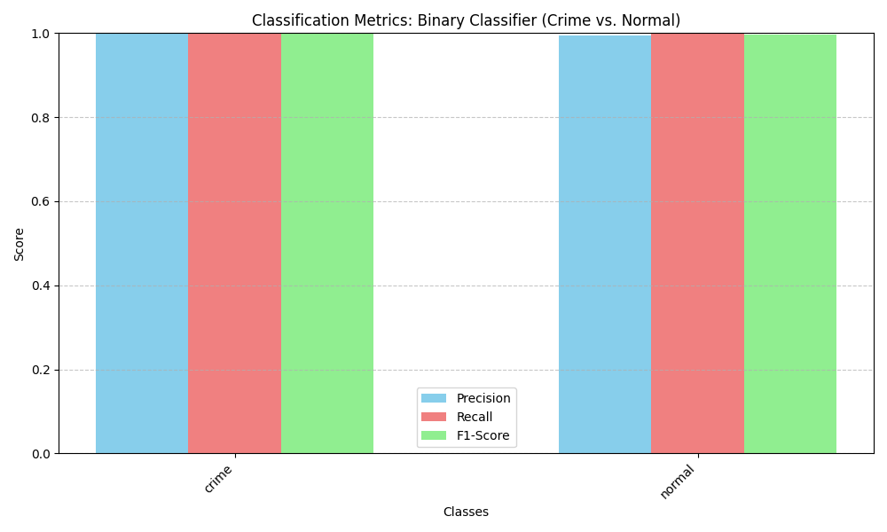
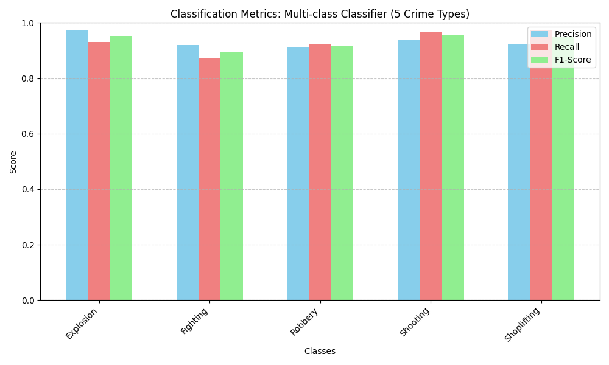
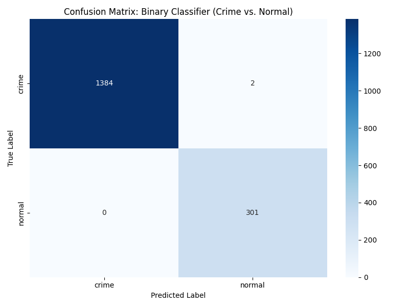
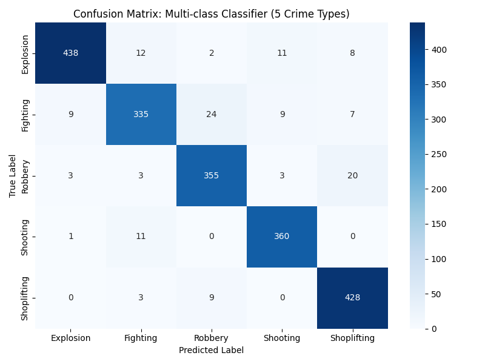

# SceneSolver
Video analyzing application 
=======
<div align="center">

# 🔍 SceneSolver
### AI-Powered Forensic Video Analysis

[](https://python.org)
[](https://flask.palletsprojects.com)
[](https://pytorch.org)
[](https://mongodb.com)
[](https://ultralytics.com)
[](https://github.com/WrishG/scenesolver-ai)

**[🌐 Live Demo](https://scenesolver-ai.onrender.com)** — no account needed

> 🎯 **98% binary accuracy · 88% F1 multi-class** on UCF-Crime benchmark · Runs on a 4GB GTX 1650


</div>

---

## What It Does

SceneSolver ingests a video and runs it through a **5-model AI pipeline** using an early-exit architecture — a binary CLIP model gates the expensive models so BLIP and BART only run when crime is actually detected. Outputs a downloadable PDF forensic incident report.

Trained and evaluated on the **UCF-Crime dataset** — **5 crime classes:** Fighting, Shooting, Explosion, Robbery, Shoplifting.

---

## 5-Stage Analysis Pipeline

```
Video Input
    │
    ▼
[1] Binary CLIP         ──→  Normal frame? → Skip (saves compute)
    │ Crime frame
    ▼
[2] Multi-class CLIP    ──→  Crime type: Fighting / Theft / Explosion / Shooting ...
    │
    ▼
[3] BLIP Captioner      ──→  "A person throws a punch near the storefront entrance"
    │
    ▼
[4] YOLOv8 + ByteTrack  ──→  Tracked objects: person ×5, backpack ×1 ...
    │
    ▼
[5] BART Summarizer     ──→  Forensic incident summary paragraph
    │
    ▼
PDF Report + Crime Clip Export
```

### System Architecture


---

## Results

### Training — Multi-class Classifier (5 Crime Types)


### Per-class Metrics

| | Binary Classifier | Multi-class Classifier |
|---|---|---|
| **Metric chart** |  |  |
| **Confusion matrix** |  |  |


## Key Features

- 🎯 **5-class crime classification** — Fighting, Shooting, Explosion, Robbery, Shoplifting
- 🚀 **Early-exit architecture** — binary CLIP gates expensive models; BLIP/BART skip normal frames entirely
- 📡 **Live stream & RTSP support** — real-time analysis via webcam or IP camera (DirectShow backend)
- 🎬 **Pre-event crime clip extraction** — 5-second rolling buffer captures what led *up to* the crime
- 🔍 **ByteTrack persistent object tracking** — person ID 1 is the same person across the whole video
- 📄 **PDF forensic report** — one-click downloadable report with verdict, tracked objects, and AI summary
- 🔐 **User auth + history** — session-based login, hashed passwords, per-user analysis history in MongoDB

---

## Optimization Highlights

The full pipeline is ~6-8GB of raw model weights. Runs entirely on a **4GB GTX 1650** after optimization:

| Technique | Impact |
|---|---|
| **Classifier head extraction** | 16MB saved weights vs 500MB full model — **70% VRAM reduction** |
| **FP16 safetensors (BLIP)** | Model size halved with no quality loss |
| **BitsAndBytes 8-bit (GPU)** | BLIP loaded in 8-bit — 4× smaller in VRAM |
| **Dynamic INT8 quantization (CPU)** | BART + classifiers auto-quantized when no GPU detected |
| **OpenCV motion pre-filter** | Static/zero-motion frames skipped before hitting the GPU |
| **Batch processing (size 8)** | Full GPU pipeline utilization — not naive frame-by-frame |
| **Lazy BART loading** | Summarizer loaded on first request only — faster startup |

---

## Tech Stack

| Layer | Technology |
|---|---|
| Web framework | Flask + Gunicorn |
| Database | MongoDB Atlas |
| Deep learning | PyTorch 2.3, Hugging Face Transformers |
| Vision models | OpenAI CLIP ViT-B/32, Salesforce BLIP, YOLOv8n |
| Language model | Facebook BART-large-CNN |
| Object tracking | ByteTrack (via Ultralytics) |
| PDF generation | ReportLab |
| Video processing | OpenCV, Pillow |

---

## Local Setup

### Prerequisites
- Python 3.10+
- MongoDB Atlas account (free tier works)
- NVIDIA GPU recommended (runs on CPU too, slower)

### 1. Clone
```bash
git clone https://github.com/WrishG/scenesolver-ai.git
cd scenesolver-ai
```

### 2. Virtual environment
```bash
# Windows
python -m venv venv
venv\Scripts\activate

# macOS/Linux
python3 -m venv venv && source venv/bin/activate
```

### 3. Install dependencies
```bash
pip install -r requirements.txt
```

### 4. Download model weights
Download the trained weights from Hugging Face and place them in the `models/` folder:
```bash
mkdir models
# Download: auto_head_multi.pth, binary_head.pth, blip_finetuned.safetensors, yolov8n.pt
```
> Model weights are not committed to this repo due to file size. Contact for access.

### 5. Environment variables
```bash
cp .env.example .env
# Fill in SECRET_KEY and MONGO_URI in .env
```

### 6. Run
```bash
flask run
# → http://127.0.0.1:5000
```

---

## Live Demo Deployment

A demo-only version (`app_demo.py`) with pre-computed results is deployed on Render free tier using only Flask + Gunicorn (~50MB RAM).

```bash
# Run demo locally
python app_demo.py
```

---

## Contact

**Ashish** — [mnvashish@gmal.com](mailto:mnvashish@gmal.com)


